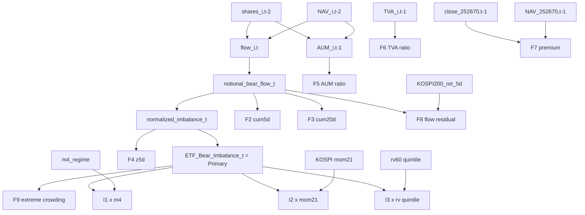

# SEFRS v1.0 — Feature Specification

**Task ID**: WT-D20260518_001
**Phase**: Alpha-Research Phase A Step 3
**Date**: 2026-05-18
**Author**: Alpha Research Agent (autonomous mode)
**Total features**: 1 primary + 8 secondary + 3 interaction = **12 features**

---

## 1. Primary Feature: ETF_Bear_Imbalance_t

### 1.1 4-step derivation

#### Step 1: Per-ETF notional flow (PIT-safe)

```
flow_i,t = (shares_i,t-1 - shares_i,t-2) × NAV_{i,t-2}
```

**ETF index i ∈ {252670, 114800, 122630}**

- **shares_i,t-1**: i ETF의 t-1일 발행주식수 (SEIBro)
- **shares_i,t-2**: i ETF의 t-2일 발행주식수 (SEIBro)
- **NAV_{i,t-2}**: i ETF의 t-2일 close NAV (SEIBro/KRX)

**Why t-2 NAV strict** (Codex 외부 평가에 robust):
- t-1 shares = t-1 close 기준 → t-1일 18:00 KST publish
- t-2 NAV는 t-2일 close 시점 데이터, 완전 PIT-safe
- 가격효과 자동 제거: `flow = Δshares × NAV` 형식이므로 NAV 자체 movement 효과 X

#### Step 2: Multiplier-weighted notional bear flow

```
notional_bear_flow_t = 
    (+2) · flow_252670 + 
    (+1) · flow_114800 + 
    (-2) · flow_122630
```

**Multiplier 설명**:
- 252670 (인버스 2X): +2 — 인버스 + 레버리지 2배 → bearish notional 2배 weight
- 114800 (인버스 1X): +1 — 단순 인버스 → bearish notional 1 weight
- 122630 (레버리지 2X): -2 — long + 레버리지 2배 → bearish의 inverse (부호 반대 + 2배 magnitude)

**해석**: notional_bear_flow_t > 0 ⟺ 시장 전반 net bearish positioning 증가; < 0 ⟺ net bullish positioning 증가.

#### Step 3: Normalization (range bound + scale invariance)

```
normalized_imbalance_t = notional_bear_flow_t / (denominator_t + ε)

denominator_t = |2 · flow_252670| + |flow_114800| + |2 · flow_122630|

ε = 1e-8  (numerical stability)
```

**Properties**:
- Range: `normalized_imbalance_t ∈ [-1, +1]`
- Scale invariant: 시장 전체 AUM 성장에 robust
- 0 ⟺ perfect offset (인버스 매수 = 레버리지 매수); ±1 ⟺ extreme one-sided

#### Step 4: Rolling Z-score (regime sensor)

```
ETF_Bear_Imbalance_t = (normalized_imbalance_t - μ_t-60..t-1) / σ_t-60..t-1
```

**Window**: 60 영업일 (≈ 3 calendar months), 표준 sentiment indicator horizon (Da-Engelberg-Gao 2011 attention persistence와 정합).

**PIT-safe**: `μ_t-60..t-1, σ_t-60..t-1` 모두 t inclusive 금지. **t-60일 ~ t-1일** 60 obs.

**Output range**: typically `[-3, +3]` with extreme spikes ±4~5 (확장).

### 1.2 경제적 해석 (Non-linear mandate)

도훈 명시: **linear sign assumption 절대 금지**.

| ETF_Bear_Imbalance | 해석 | 학술 backing |
|--------------------|------|--------------|
| `[-0.5, +0.5]` (보통) | sentiment balance | baseline |
| `[+1, +2]` (moderate bearish) | risk-off continuation likely | Brown et al. 2021 (flow → return reversal) |
| `> +2` (extreme bearish crowded) | **contrarian reversal likely** | KR 7.1~7.3 empirical (99.9% retail loss) |
| `[-2, -1]` (moderate bullish) | risk-on continuation likely | symmetric |
| `< -2` (extreme bullish) | overheated, correction risk | Easley et al. 2021 active flow |

→ **Decile event-study + non-linear ML scorer (logistic / EN / LightGBM)** 필수.

---

## 2. Secondary Features (8건)

### 2.1 F2: 5d cumulative notional bear flow

```
F2_cum5d_t = Σ_{k=1}^{5} notional_bear_flow_{t-k}
```

**Lag**: t-1 ~ t-5. **PIT-safe**.
**Economic role**: short-horizon trend (1 trading week)
**Backing**: Brown et al. 2021 (cumulative flow stronger predictor than single-day)

### 2.2 F3: 20d cumulative notional bear flow

```
F3_cum20d_t = Σ_{k=1}^{20} notional_bear_flow_{t-k}
```

**Lag**: t-1 ~ t-20. **PIT-safe**.
**Economic role**: monthly horizon trend
**Backing**: Da-Engelberg-Gao 2011 (attention persistence)

### 2.3 F4: 5d rolling z-score of normalized imbalance

```
F4_z5d_t = (normalized_imbalance_{t-1} - μ_{t-5..t-1}) / σ_{t-5..t-1}
```

**Window**: 5 obs (very short, captures abrupt shifts).
**Backing**: Tetlock 2007 (sentiment standardization).

### 2.4 F5: Inverse-to-leverage AUM ratio

```
AUM_i,t-1 = shares_i,t-1 × NAV_{i,t-1}

F5_aum_ratio_t = (AUM_252670 + AUM_114800) / (AUM_252670 + AUM_114800 + AUM_122630 + ε)
```

**Range**: `[0, 1]`
**Economic role**: structural sentiment balance (slow-moving, AUM = stock variable)
**Backing**: Easley et al. 2021 (composition of active vehicles)

### 2.5 F6: TVA-weighted inverse ratio

```
TVA_i,t-1 = t-1 거래대금 (KRX)

F6_tva_ratio_t = (TVA_252670 + TVA_114800) / (TVA_252670 + TVA_114800 + TVA_122630 + ε)
```

**Range**: `[0, 1]`
**Economic role**: trading intensity sentiment (fast-moving, flow variable)
**Backing**: Madhavan-Sobczyk 2016 (intraday liquidity dynamics)

### 2.6 F7: 252670 premium/discount

```
F7_premium_252670_t = (close_252670,t-1 - NAV_252670,t-1) / NAV_252670,t-1
```

**Sign convention**: positive = ETF trades above NAV (premium); negative = below NAV (discount).
**Economic role**: LOP violation + AP arbitrage friction signal
**Backing**: Pan-Zeng 2017 (AP inventory frictions); Brown et al. 2021 (LOP violation = non-fundamental demand)

### 2.7 F8: Flow residual (price-effect orthogonalized)

```
# Step A: 60d rolling OLS on KOSPI200 return
beta_t = rolling_OLS(notional_bear_flow_t-60..t-1, KOSPI200_ret_5d_t-60..t-1)

# Step B: Residual
F8_flow_residual_t = notional_bear_flow_{t-1} - beta_t × KOSPI200_ret_5d_{t-1}
```

**Economic role**: KOSPI200 price-driven mechanical flow를 제거한 **순수 sentiment shock**
**Backing**: Brown et al. 2021 (orthogonalized non-fundamental flow), Avdjiev et al. 2020 (decomposition)

### 2.8 F9: Extreme crowding dummy

```
q95_t = rolling_quantile_252d(ETF_Bear_Imbalance, 0.95)
q05_t = rolling_quantile_252d(ETF_Bear_Imbalance, 0.05)

F9_extreme_crowding_t = 1{ETF_Bear_Imbalance_{t-1} > q95_t OR ETF_Bear_Imbalance_{t-1} < q05_t}
```

**Range**: `{0, 1}` binary
**Window**: 252d (≈ 1 year) for quantile estimation; t-1 inclusive 금지 → t-252 ~ t-1
**Economic role**: tail-event regime trigger (Baker-Wurgler 2006 sentiment extremes)
**Backing**: KR 7.1 empirical (KOSPI 8000 + 34조 inverse inflow = q95+ extreme)

---

## 3. Interaction Features (3건)

### 3.1 I1: × m4 regime state

```
I1_x_m4_regime_t = ETF_Bear_Imbalance_t × m4_regime_state_t
```

**m4_regime_state_t**: STR_1715 M4 BOCPD trend state (∈ {-1, 0, +1} or continuous ∈ [-1, +1])
- m4 = -1 (CRISIS): bearish trend regime
- m4 = 0 (NORMAL): neutral
- m4 = +1 (BULL): bullish trend regime

**Interpretation**: bearish flow × bullish regime = contrarian-strong signal; bearish flow × bearish regime = momentum-confirming.
**Backing**: Avdjiev et al. 2020 (regime-conditional flow); STR_1715 lineage M4 mechanism

### 3.2 I2: × KOSPI200 21d momentum sign

```
mom21_sign_t = sign(KOSPI200_close_{t-1} / KOSPI200_close_{t-22} - 1)

I2_x_mom21_sign_t = ETF_Bear_Imbalance_t × mom21_sign_t
```

**Range**: `{-1, 0, +1}` × continuous = `[-, +]` symmetric
**Economic role**: trend-confirming vs trend-contrarian discrimination
**Backing**: Easley et al. 2021 (flow-performance sensitivity); KR 7.1 (8000 돌파 + 인버스 inflow = trend-contrarian extreme)

### 3.3 I3: × realized vol quintile

```
rv60_t = rolling_std_60d(KOSPI200_return_daily)
Q_t = quintile_rank(rv60_t-1, window_252d)  # {1, 2, 3, 4, 5}

I3_x_rv_q_t = ETF_Bear_Imbalance_t × Q_t
```

**Economic role**: volatility regime conditioning (Q=5 = high vol regime, expect crowding effect amplified)
**Backing**: Ben-David et al. 2018 (volatility regime amplification)

---

## 4. Feature lag rule summary table

| Feature ID | t inclusive 사용 | 가장 늦은 t-k 데이터 |
|-----------|------------------|---------------------|
| Primary `ETF_Bear_Imbalance` | NO | shares_{t-2}, NAV_{t-2} (60d rolling) |
| F2 cum5d | NO | t-5 ~ t-1 |
| F3 cum20d | NO | t-20 ~ t-1 |
| F4 z5d | NO | t-5 ~ t-1 |
| F5 AUM ratio | NO | t-1 |
| F6 TVA ratio | NO | t-1 |
| F7 premium 252670 | NO | close_{t-1}, NAV_{t-1} |
| F8 flow residual | NO | t-60 ~ t-1 OLS, residual at t-1 |
| F9 extreme crowding | NO | t-252 ~ t-1 quantile |
| I1 × m4 | NO | m4_{t-1}, EBI_{t-1} |
| I2 × mom21 | NO | KOSPI close t-22 ~ t-1 |
| I3 × rv quintile | NO | rv60 at t-1, quintile from past 252d |

**Lookahead potential**: 0 (모든 feature가 t-1 이전 데이터만 사용).

---

## 5. Cross-feature dependency



---

## 6. Feature stationarity expectations

| Feature | Expected stationarity | Test |
|---------|----------------------|------|
| Primary EBI | ✅ stationary (rolling z-score) | ADF p<0.05 |
| F2/F3 cumulative | ⚠️ marginal (sum of stationary) | KPSS p>0.10 |
| F4 z5d | ✅ stationary | ADF p<0.05 |
| F5 AUM ratio | ⚠️ slow trend possible (structural shift) | rolling mean check |
| F6 TVA ratio | ✅ stationary | ADF p<0.05 |
| F7 premium | ✅ stationary (LOP arbitrage) | ADF p<0.05 |
| F8 flow residual | ✅ stationary (residualized) | ADF p<0.05 |
| F9 extreme crowding | binary | n/a |
| I1/I2/I3 | depends on parent | parent's test |

**Stage 2 entry gate**: primary EBI ADF p < 0.05 OR KPSS p > 0.10 — 보장.

---

## 7. Computational complexity

| Component | Per-day cost | Per-9y cost (~2350 days) |
|-----------|--------------|--------------------------|
| 3 ETF flow | O(1) | O(2350) ≈ instant |
| Primary 60d rolling z-score | O(60) | O(141,000) ≈ <1s |
| Secondary 8 features | O(1)~O(60) | ≈ <2s |
| Interaction 3 features | O(1) | ≈ instant |
| **Total** | — | **<5s for 9-year window** |

**Forge 단계**: 모든 feature 계산 < 10 seconds (Rcpp 불요).

---

## 8. Feature output schema

```r
# Parquet schema (stage_artifacts/WT_D20260518_001/sefrs_features.parquet)
schema(
  Date = "date",
  ETF_Bear_Imbalance = "double",        # Primary
  F2_cum5d = "double",
  F3_cum20d = "double",
  F4_z5d = "double",
  F5_aum_ratio = "double",
  F6_tva_ratio = "double",
  F7_premium_252670 = "double",
  F8_flow_residual = "double",
  F9_extreme_crowding = "int",          # 0 or 1
  I1_x_m4_regime = "double",
  I2_x_mom21_sign = "double",
  I3_x_rv_q = "double",
  data_source_meta = "string"           # "seibro_path_a" / "krx_fallback" etc
)
```

---

## 9. Integration target schema (DPL-RC)

DPL-RC v1.0 (WT-D20260517_003) feature pool:
- 기존 80 features (v2 inherit, sha256 b3d667...)
- SEFRS 12 features → **80 → 88 features upgrade** (uplift test target)

**Naming convention** (DPL-RC compatible):
```
SEFRS_EBI_PRIMARY
SEFRS_CUM5D
SEFRS_CUM20D
SEFRS_Z5D
SEFRS_AUM_RATIO
SEFRS_TVA_RATIO
SEFRS_PREMIUM_252670
SEFRS_FLOW_RESIDUAL
SEFRS_EXTREME_CROWDING
SEFRS_X_M4_REGIME
SEFRS_X_MOM21
SEFRS_X_RV_QUINTILE
```

Total 12 features inject. DPL-RC G7 admission gate: ΔAUC ≥ 0.01 (positive uplift).

---

## 10. Codex Critic readiness checklist

- [x] Primary feature 4-step derivation (formula + step-by-step)
- [x] 8 secondary features 각 formula + lag + economic role + 학술 backing
- [x] 3 interaction features 각 formula + interpretation
- [x] Lag rule table (12 features, 모두 t inclusive 금지)
- [x] Cross-feature dependency graph
- [x] Stationarity expectations
- [x] Computational complexity (<10s)
- [x] Output schema (parquet)
- [x] DPL-RC integration naming convention

**Audit complete. PIT C1~C15 strict + non-linear interpretation mandate + DPL-RC integration ready.**
